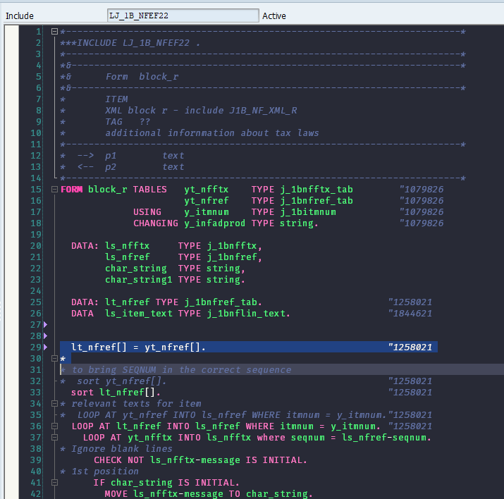

# Dracula Theme for ABAP
This is a dark theme for ABAP (NetWeaver), inspired in the [dracula](https://draculatheme.com/) color scheme, one of most used themes for many editors and IDE's, such as Atom, Sublime Text, IntelliJ, VSCode and many others.

# Dark Normal Demo

# Dark Pinkish Demo

# Install
Go to this folder in your machine to find the theme files:

<pre>%APPDATA%\SAP\SAP GUI\ABAP Editor\</pre>

It's recommended at this point that you create a backup of your original files.
Replace the `abap_spec.xml` file with the template of your choice.  Start SAPgui again and your ABAP editor will now use the new theme.
One last tip for you is that you can change your font as well. I am using `Fira Code Retina` (It should be installed in your machine).
# Contribution
Fell free to suggest any improvements edit as you wish.
